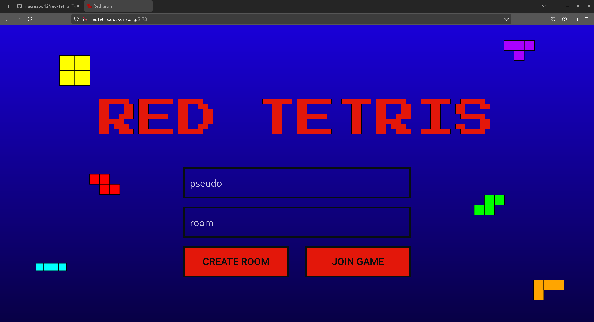
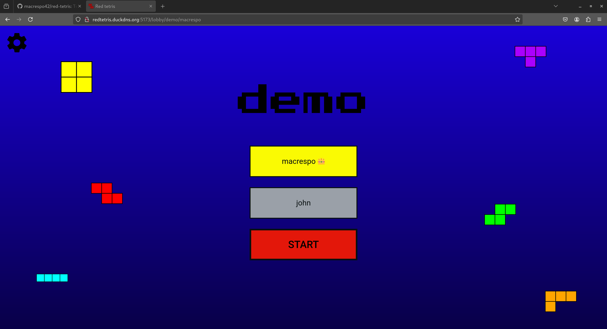
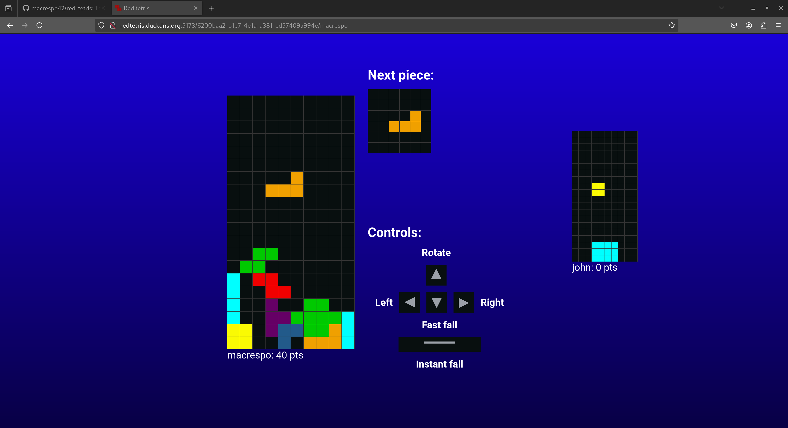

  

# Red Tetris

An online battle royal tetris game

## Presentation

The game is available [here](http://redtetris.duckdns.org:5173/)

You can create or join a Room to start playing with your friends

Then wait for your friends to join

And enjoy!

At the right of the screen you can show a minimap of your opponent fields, and just at the right of your field the list of availables commands  
The last who stay alive whon the game!

## Rules

The last to survive is the winner!
If you score a line you can inflict scored line - 1 malus line to your opponents

If you play in solo the goal is to score the maximum of points!

## Gamemode

Several gamemodes are availables

- Broken piece: You have a chance to got a Broken piece (a piece where you can't score a line with)
- Sudden death: The first player who score a line won the game
- Domination: The penalty is doubled when you score a line
- Quick: The game goes fastes (blazingly faster)
